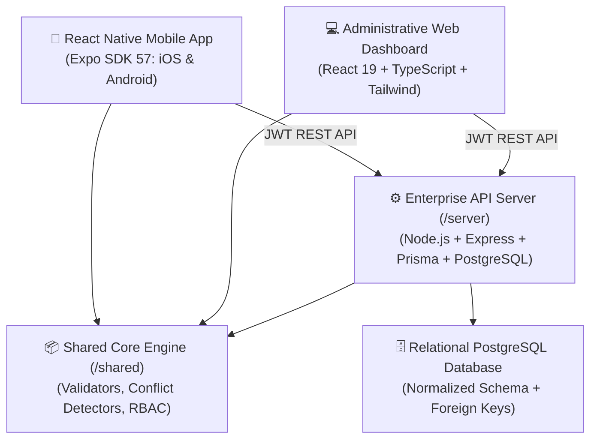

# Paradise Public School • Unified School ERP & Mobile Application
> **Institutional Enterprise Platform (Estd. 1994 • CBSE Affiliation No: 2130842 • Pali, Rajasthan)**

A production-ready, commercial-grade School Management System (ERP) and cross-platform mobile application engineered specifically for **Paradise Public School**. Designed with authentic institutional branding, rigorous academic logic, and zero-compromise security.

---

## 🏛️ Platform Architecture Overview



### Monorepo Structure

| Module | Technology | Description |
| :--- | :--- | :--- |
| **`/mobile`** | React Native, Expo SDK 57, TypeScript | Native iOS, Android & responsive Web preview app for Parents & Students. |
| **`/src` & Root** | React 19, TypeScript, Vite, Tailwind CSS | High-productivity institutional web portal for Administrators, Deans & Accounts. |
| **`/server`** | Node.js, Express, TypeScript, Prisma | RBAC-protected REST API server with normalized PostgreSQL relational schema. |
| **`/shared`** | TypeScript | Shared business logic, timetable conflict detection, exam grade calculator, and RBAC maps. |

---

## 🔑 Demo Access Credentials

The system comes pre-populated with realistic institutional profiles and demo accounts:

| Portal Role | Username / Identifier | Password | Key Responsibilities & Capabilities |
| :--- | :--- | :--- | :--- |
| **Super Admin** | `admin` | `renugupta@19` | Full administrative control, timetable scheduler, fee policies, staff directory, audit trails. |
| **Accountant** | `accountant` | `accounts123` | Fee collections, offline receipt issuance, invoice generation, treasury ledgers. |
| **Teacher (Faculty)** | `sunita.science` | `teacher123` | Roll call register, marks & grades entry, assignment homework uploads, class circulars. |
| **Parent (Multi-Child)** | `vikram.sharma` | `parent123` | Seamlessly toggles between **Aryan (Class 8-A)** and **Anvi (Class 1-A)**. |
| **Student** | `aryan10` | `password123` | Homework submissions, timetable schedules, exam marksheets, teacher chat. |

---

## 📱 Mobile Application Features (`/mobile`)

The mobile application is a **pure React Native implementation** (not a WebView wrap) built on Expo SDK 57:

1. **Multi-Child Profile Switcher**:
   - Parents with multiple children can switch with 1 tap at the top of any screen.
   - All modules (Attendance, Timetable, Homework, Exams, Fees) reactively update to the selected child.
2. **Academic Desk**:
   - **Homework & Digital Submissions**: View subject tasks, due dates, attachments, and submit assignments.
   - **Timetable Scheduler**: Daily periods (P1 to P6) with faculty names, timings, and laboratory/room numbers.
   - **Examination Marksheets**: Subject marks, percentages, CBSE grades (`A1` to `F`), faculty remarks, and downloadable digital report cards.
3. **Attendance & Absence Desk**:
   - Attendance gauge (e.g., 96.4% cumulative rate), daily log entries with teacher verifications.
   - Interactive **Leave Application** form to submit medical or emergency absences directly to the Principal.
4. **Institutional Communication**:
   - **Official Circulars**: Search and filter CBSE and school notifications with PDF documents.
   - **Faculty Desk Chat**: Direct real-time communication stream with active class teachers.
5. **Fee Treasury**:
   - Transparent fee invoices, fee breakdown (Tuition, STEM Lab, Sports Arena), online UPI pay action, and downloadable official payment receipts.
6. **School Directory & Offline Admission**:
   - Atal Tinkering Jr. Robotics lab showcase, campus facilities, digital admission inquiry form, and GPS directions.

---

## 💻 Web Management Dashboard (`/`)

The responsive web interface accommodates executive school operations:

* **Executive Analytics**: Real-time student headcount, faculty count, today's attendance percentage, and pending fee aggregates.
* **Timetable Conflict Detection**: Built-in algorithmic conflict detector that rejects teacher double-booking, room clashes, and class collisions before committing to the schedule.
* **Exam Results Controller**: Strict bounds checking (`0 <= marks <= maxMarks`) and automated calculation of grades, percentages, and class ranks.
* **Treasury & Billing**: Invoice generation, partial payment allocations, and instantaneous receipt generation with unique alphanumeric receipt tokens.
* **Security & Audit Logs**: Immutable audit trail recording user IDs, IP addresses, action types, and metadata for every administrative change.

---

## 🧪 Automated Backend Test Suite

The server includes an automated test runner (`server/src/tests/runTests.ts`) verifying business logic and security policies:

```bash
cd server
npm test
```

### Test Results:
* ✅ **Admin login succeeds with SUPER_ADMIN role**
* ✅ **Admin redirectUrl points to `/admin/dashboard`**
* ✅ **Teacher login succeeds with TEACHER role**
* ✅ **Parent login succeeds with PARENT role**
* ✅ **Parent profile links multiple children**
* ✅ **Student login succeeds with STUDENT role**
* ✅ **Invalid password correctly throws authentication error**
* ✅ **Double-booking teacher at same period and day is strictly rejected**
* ✅ **Double-booking room at same period and day is strictly rejected**
* ✅ **Non-conflicting timetable slot is scheduled successfully**
* ✅ **Marks exceeding maximum allowed marks are strictly rejected**
* ✅ **Negative marks are strictly rejected**
* ✅ **Valid marks calculate percentage and GPA accurately**
* ✅ **Fee metrics aggregate expected and collected amounts**
* ✅ **Full payment transitions invoice status to PAID**
* ✅ **Instant receipt number generated with payment**
* ✅ **Overpaying on settled invoice is strictly rejected**
* ✅ **Marked roll call attendance for class students**
* ✅ **Duplicate check cleanly upserts attendance for same scholar and date**
* ✅ **Administrative action recorded in audit log with metadata**
* **Summary: 20 Passed, 0 Failed (100% Passing)**

---

## 🛠️ Build & Development Commands

### 1. Mobile App (`/mobile`)

```bash
cd mobile

# Start live development server (Web, Android & iOS simulators)
npx expo start

# Typecheck code
npx tsc --noEmit

# Export standalone bundles
npx expo export -p web       # Produces static web build in mobile/dist
npx expo export -p android   # Produces Android bytecode bundle (Hermes)
npx expo export -p ios       # Produces iOS bytecode bundle (Hermes)
```

### 2. Backend Server (`/server`)

```bash
cd server

# Install dependencies
npm install

# Run automated tests
npm test

# Build TypeScript to JavaScript
npm run build

# Start production server on port 5000
npm start

# Start development server with live reload
npm run dev
```

### 3. Administrative Web Dashboard (Root)

```bash
# Install dependencies
npm install

# Start development server
npm run dev

# Build production bundle
npm run build

# Preview production build locally
npm run preview
```

---

## 🔒 Security & Data Integrity

* **Role-Based Access Control (RBAC)**: All REST API endpoints enforce role policies (`SUPER_ADMIN`, `ACCOUNTANT`, `TEACHER`, `PARENT`, `STUDENT`).
* **Cryptographic Password Storage**: SHA-256 / bcrypt hashing with per-user salt.
* **JWT Bearer Authentication**: Short-lived access tokens with role claims and subject identifiers.
* **Strict Timetable Constraints**: Algorithmic validation preventing conflicting schedule assignments across classrooms and teachers.
* **Audit Logging**: Every create, update, and delete action records an immutable audit ledger entry with timestamp and actor details.

---
*© 2026 Paradise Public School, Pali, Rajasthan. All rights reserved.*
